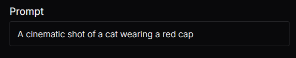
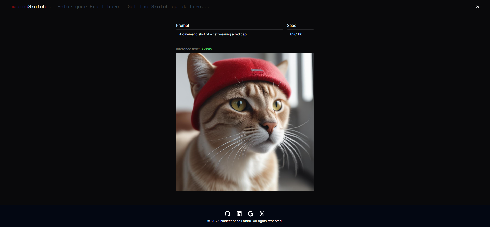

# 🖼️ Real-Time Text-to-Image Generator Web Application

This project is a modern and interactive web application that enables users to generate images from text prompts in real time. The core idea behind this application is to provide a seamless and intuitive way for users to transform their creative ideas, thoughts, and imaginations into visually stunning images—simply by describing them in words.

---

## 🌐 About the Project

- **Real-Time Image Generation**: Users enter a text prompt (e.g., *"a futuristic city at sunset"*) and receive a corresponding image within seconds.
- **Intuitive Design**: A seamless user experience powered by **React.js** and **JavaScript**, offering fast and smooth interactions.
- **Creative and Educational**: Whether you're an artist, student, or designer, this app allows for creative exploration of AI-generated art.

---

## 🛠️ Built With

- **React.js**: A powerful JavaScript library used for building fast and modular user interfaces.
- **JavaScript (ES6+)**: Core programming language for implementing app logic and handling API calls.
- *(Optionally include your image generation API/library here, e.g., OpenAI's DALL·E or similar.)*

---

## ⚙️ Key Features

- ✨ **Real-Time Image Generation**  
  - Images are generated and displayed within seconds after entering a prompt.

- 📝 **Natural Language Prompting**  
  - Users can input detailed natural language descriptions to guide the image creation process.

- 💻 **Fast and Interactive UI**  
  - Built with **React** for optimal rendering performance and smooth user interaction.

- 🌍 **Accessible via Web Browser**  
  - No installations required—runs directly in the browser on desktop and mobile.

- 🔁 **Creative Exploration**  
  - Experiment with different prompts to generate endless visual outputs.

---

## 💡 Advantages of the Project

- **Ease of Use**: Simple interface that anyone can use without prior technical knowledge.
- **Real-Time Feedback**: Instant generation allows users to experiment quickly and see results fast.
- **Cross-Browser Compatibility**: Works seamlessly across modern web browsers.
- **Front-End Focused**: Demonstrates strong skills in React development, UI design, and JavaScript logic.
- **Educational Value**: Great learning project for understanding the connection between natural language processing and image generation.
- **Inspiration Tool**: Useful for content creators, writers, designers, and anyone seeking visual inspiration from text.

---

## 📌 Use Cases

- **Generating Concept Art**: Transform story ideas into visual concepts.
- **Design Inspiration**: Visualize scenes or characters for design projects.
- **Educational Demonstration**: Learn about front-end applications interacting with AI/ML models.
- **Creative Exploration**: Personal creative projects or just for fun!

---

## 📸 Screenshots

Here are a few screenshots of the application in action:

- 🔤 **Prompt Input Interface**  
  

- 🖼️ **Generated Image Display**  
  

---

## 🌐 Live Demo

Check out the live version of the app here:  
👉 [**Live Demo**](https://your-live-app-link.com)

You can try it out by entering any prompt like:
- *"A fantasy dragon flying over snowy mountains"*
- *"A cyberpunk cityscape at night with neon lights"*
- *"An astronaut riding a horse on Mars"*

---

